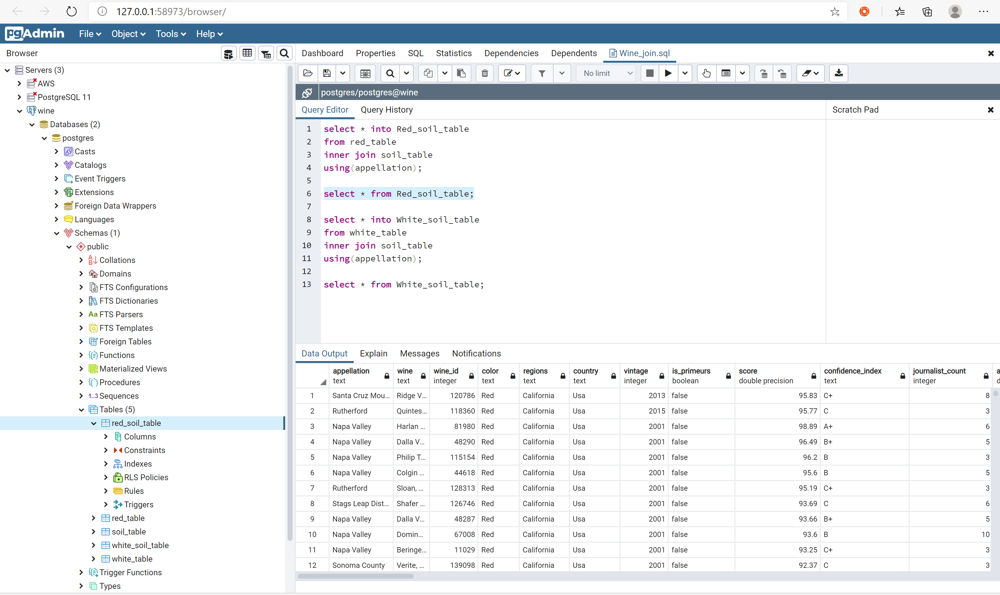
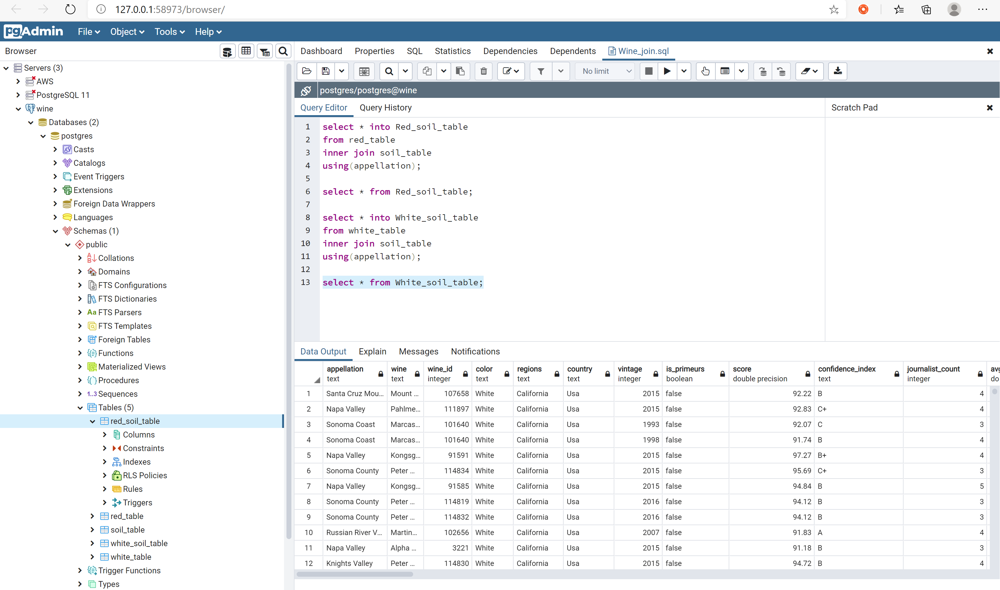

# *Partners In Wine*

## Selected topic:

Weather and soil conditions affecting wine quality

## Reason we selected the topic:

We like wine , diverse dataset, enough information to pull across three API's. One for red and white wine , one for weather and one for soil. 

## Description of the source of data:

* Wine API - https://www.globalwinescore.com/api/ 
* Weather API - https://www.ncei.noaa.gov/access/search/data-search/global-summary-of-the-year
* Weather Analysis - https://www.evineyardapp.com/blog/2019/01/17/climate-weather-and-vineyard-management/
* Red and White Wine pic - https://wineonmytime.com/wp-content/uploads/2019/09/Can-You-Mix-Red-and-White-Wine-Hero.png
* Amy-Schumer-oversized-glass-of-wine.gif https://i1.wp.com/foolishwatcher.com/wp-content/uploads/2017/05/amy-schumer-oversized-glass-of-wine.gif?resize=500%2C283&ssl=1
* Grapes In Hands https://www.focusfitness.net/stock-photos/downloads/man-hands-holding-grapes-healthy-eating-concept/

##  Resources

Data Source:  Python 3.7.6, Anaconda 4.8.4, Jupyter Notebook 6.0.3, Google Colaboratory, spark 3.0.1, java-11, PostgreSQL11.8 (pgAdmin 4.23)
 
## Technologies Used

### Data Cleaning and Analysis

Pandas will be used to clean the data and perform an exploratory analysis. Further analysis will be completed using Python.

### Database Storage

PostgreSQL will be the database we intend to use to store data.

### Machine Learning

SciKitLearn is the ML library we'll be using to create a classifier.  Deep neural network, Random Forest, and Logistic regression were used to train our model.

### Dashboard

Tableau will be used to connect the database and create visualizations. 

***Link to our Tableau dashboard: [Wine Quality Dashboard](https://public.tableau.com/profile/valencia.loyd2616#!/vizhome/Group_5_wine_16046307141490/PartnersinWine?publish=yes)***

## Communication Protocols

Communicate through Slack.  Everyone uploads data to their Github branch and create a pull request.  Sonia merges the data after everyone discuss the final plans. 

## Outline of project 

#### Presentation 

  ##### Google Slides 
  ***Link to rough draft of our presentation on google slides:[Wine Quality Machine Leanring](https://docs.google.com/presentation/d/1-MctTWS8TrRcArjXzD5Xvzrx4bVrTv7aOP1SWWkiZ2g/edit?usp=sharing)***

#### Github 

  * Each member of team has there own branch and makes at least 4 commits per week 
  * README.MD 

#### Data exploration 

This step involved importing APIs to call weather, wine and soil data. The data was collected from Global Wine Scores, NOAA, and the USGS website. It was then cleaned and finally merged together. Data was split between white wine and red wine before the weather and soil data was merged with it. The Global Wine Scores website has data for wines, the regions that they were grown in, and the scores associated with each wine. These vintages range from 1992 to 2016 and have an average score of approximately 91%. 
 The wine data takes different wines and scores going back to 1992.

Some of the challenges for finding the best weather data was to find zip codes that have reliable temperature and precipitation data. Most of the zip codes had data that originated before 1992 but the stations had missig dates for temperature, precipitation, or both of the values. The process for finding optimal stations involved an iterative process of importing different zip codes for temperature data and different zip codes for precipitation data to determine which zip codes have the best coverage of data. Another challenge to merging weather and wine data was that several appellations (regions) within a state straddled two different zip codes. One of the assumptions this study has made was that weather data would be the same for zip codes that were within 50 mile radius of one another. This allowed the group to assign zip codes for certain appellations and allowed the data to be merged together more succinctly. The wine data comes from wine that is concentrated in Washington State, Oregon, Napa Valley California, Sonoma County California, and the Santa Cruz Mountains in California as well. There were some appellations that only have one or two data points that were dropped from the study.

 #### Database 

  The data was connected through primary keys (unique values in the main table). See the ERD of Red Wine and White Wine below:

Once the relationship of the database was created, we use AWS to read and write data from our notebook to and from SQL. In SQL, we join soil table to the red wine table, and soil table to the white table. [SQLQuery](https://github.com/soijebor/Wine_Weather/blob/main/Database%20%26%20ML%20Notebooks/Wine_join.sql)

***[Database Notebook](https://colab.research.google.com/drive/1VZLidDt7rMeo9TxoEEyR0zL_bbrxcGTJ?usp=sharing)***

### Analysis

Look at results from wine data alone, wine data with weather data, wine data with soil data and wine data with weather and soil data. 
  
#### Machine Learning Module 

***[Red Wine ML Notebook](https://colab.research.google.com/drive/1hsgAFDhkRM_FhuLIrk_RMnTYQ8Tw5zkP?usp=sharing)***

***[White Wine ML Notebook](https://colab.research.google.com/drive/1gieR79g2leKOEltf67D-5eiiFt4LlEQq?usp=sharing)***

***1.) Description of preliminary data preprocessing :***

 * Acquire the dataset
 * Import the dependencies
 * Import the dataset
 * Checked for null values and duplicates.
 * Checked the data types.
 * Split the wine column to get the vineyard column.
 * Dropped the following columns(wine_id, wine, regions, is_primeurs, confidence_index, journalist_count, color, country) not important to the model.
 * Converted the score column from float to integer and split score into good(1) which is any wine with a score >= 91 and bad(0) and making it its own column "quality" to use as our target and dropped the score column. 
 * Checked for number of unique values in each column to find out which columns required binning and binned vineyard. 
 * Created the OneHotEncoder instance,  Fitted the encoder and produce encoded DataFrame,  renamed encoded columns and merged one-hot encoded features and drop the originals.
 * Split the data into training and testing sets
 * Scaled the data using the StandardScaler

***2.) Description of preliminary feature engineering and preliminary feature selection, including their decision making process:***

We used the wine score to determine the quality of wine and for feature we decided to look at wine data by itself and dropping all weather and soil data columns and unnecessary ccolumns from the wine data, wine data with weather data, wine data with soil data and wine data with weather and soil data.

***3.) Description of how data was split into training and testing sets:***

For splitting the data into training and testing sets I used sklearn train_test_split to split the dataset into random train and test subsets.

***4.) Model Choice, Benefits & Limitations:***
 
* Deep Learning Neural Network -  The limitation of the model is that it requires a large amount of data and it's not easy to comprehend. The benefits of this model can solve complex problems.
* Random Forest Classifier - The limitation is that features need to have some predictive power to work. The benefit is handling of huge amount of data, No problem of overfitting
* Logistic Regression - The limitation of the model is  that  it can be easily outperformed by sturdier model like  Neural Networks,  also its high reliance on a proper presentation of your data. The benefits of this model are that it's easier to implement,  very efficient to train and it outputs well-calibrated predicted probabilities.

We chose the Logistic Regression model as the best fit model for this analysis after trying multiple models and considering the structure of our data to help answer our questions.

***5.) Changes made from Segment 2 to Segment 3:***
 We added more hidden layers to our deep learning neural network and created a table for the predictions and actual predictions, and we initialized the PCA model.

***6.) Description of how they have trained the model thus far, and any additional training that will take place:***
So far, we have trained the model using deep learning neural network model with trying multiple hidden layers to get our current accuracy score, we also used the random forest classifer and the logistic regression.

***7.) Current Accuracy Score:***

## Red Wine

  * ***For the Deep Learning Neural Network;***
  
  
  
  * ***For Random Forest Classifier;***
  
  
  
  * ***For Logistic Regression;*** 
  
  

  ## White Wine

  * ***For the Deep Learning Neural Network;***
  
  
  
  * ***For Random Forest Classifier;***
  
  
  
  * ***For Logistic Regression;*** 
  
  
  
  

## Flask App/HTML

 ***[Link to the web app repository](https://github.com/soijebor/groupfive-wine#groupfive-wine)***
 
The flask app was desgined along with the HTML to allow users to input data into our app and determine if a particular wine from a particular year is a good vintage. The app takes in inputs such as: red or white wine, vintage, and the vineyard where the wine comes from. The app then uses the Machine Learning model to determine if the wine is of high quality or low quality. Some of the challenges we faced when building the app are that we have red and white wine csv files, we needed to use JavaScript to filter through the vineyards based on color because all wineries did not grow red and white grapes.

 ***[Link to the web app](https://groupfive-wine.herokuapp.com/)***

## Questions the team hopes to answer with the data:

   * How does weather impact wine quality?
   * How does score vary by region in USA , by type ( red, white) ?
   * How does soil quality affect wine quality ?

